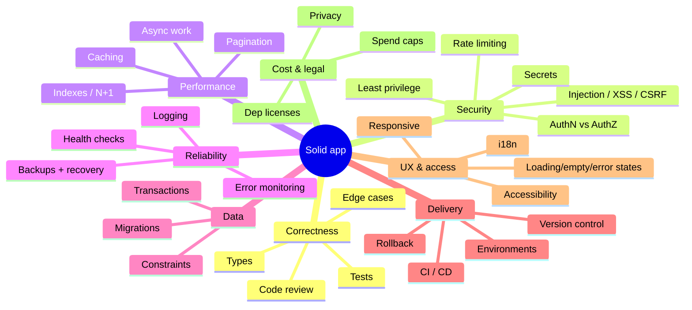

# Software Foundations — the things every app should handle

A plain-English map of what goes into *solid* software, written for someone still learning. This
is the **why**; the actionable checklist is `QUALITY-GATES.md`. Read this once for the mental model,
come back when a term shows up.

> Nobody hands you this list when you start. These are the concerns experienced developers keep in
> the back of their mind on every project. You don't need all of them on day one — but you should
> *recognize* them so you choose deliberately instead of being surprised later.

## The 8 pillars

---

## 1. Correctness — does it do the right thing?
- **Types** catch whole classes of bugs before you run anything.
- **Tests** prove behavior and stop you from breaking it later. Unit (one function), integration
  (parts together), e2e (the whole flow), contract (the API shape front & back agree on).
- **Code review** — a second pair of eyes catches what you can't see in your own code.
- **Edge cases** — empty input, huge input, zero, negative, null, the network failing mid-request.

## 2. Security — can it be abused? *(the one beginners underestimate most)*
- **Authentication vs Authorization.** AuthN = "who are you?" (login). AuthZ = "are you allowed to do
  *this*?" Checking login but not ownership ("can user A edit user B's data?") is the #1 cause of leaks.
- **The classic attacks** — know the names so you spot the risk:
  - **SQL injection:** malicious input runs as a DB command → use parameters / an ORM, never string-concat.
  - **XSS:** attacker injects script into your page → frameworks escape output by default; danger is raw HTML.
  - **CSRF:** a malicious site acts as your logged-in user → same-site cookies / tokens.
- **Secrets** never in code — env vars, git-ignored, scanned for in pre-commit.
- **Rate limiting** stops abuse and runaway cost; **least privilege** = give each user/key the *minimum* access.
- A useful reference to skim once: the **OWASP Top 10**.

## 3. Performance — is it fast enough, at scale?
- **Database** is usually the bottleneck: **index** the columns you filter/sort on; avoid **N+1**
  (one query that becomes hundreds in a loop); **paginate** — never load "all rows".
- **Caching** — don't recompute/refetch the same expensive thing repeatedly.
- **Async** — slow work (emails, scraping, AI calls) goes to a background queue; the user isn't left waiting.

## 4. Reliability — does it stay up, and not lose data?
- **Error monitoring** (e.g. Sentry) tells you something broke *before* the user emails you.
- **Logging** — structured, no PII — is how you debug a problem you can't reproduce.
- **Backups & recovery** — *"if the database died now, how much would I lose, how fast could I restore?"*
  Have an actual answer. Test a restore once.
- **Health checks & graceful failure** — when a dependency is down, degrade; don't take the whole app with it.

## 5. Data — is it consistent and safe to change?
- **Migrations** version your database schema like git versions code — never hand-edit prod.
- **Transactions** — when multiple writes must all succeed or all fail, group them; never half-write.
- **Constraints** (foreign keys, NOT NULL, UNIQUE) enforce rules *in the database* — the last line of defense.

## 6. Delivery — how does code get to users, safely?
- **Version control + small commits + branches + PRs** — already your workflow.
- **CI/CD** runs your checks automatically and deploys; a human bypassing checks locally can't bypass CI.
- **Environments:** dev → **staging** (a prod-like test copy) → prod. Keep them similar.
- **Rollback** — know how to undo a bad deploy in ~60 seconds *before* you need to.

## 7. UX & accessibility — is it usable by everyone?
- **Four states per screen:** loading, empty, error, success — build all four. Missing states are why
  a working app *looks* broken when data is slow or absent.
- **Accessibility:** keyboard, labels, alt text, contrast — it's also just good UX.
- **i18n:** don't hardcode text/dates/currency if you might ever support other languages/regions.

## 8. Cost & legal — the boring stuff that bites later
- **Spend caps & cost alerts** — cloud and paid APIs (especially LLMs) can run up a bill fast.
- **Dependency licenses** — some open-source licenses restrict commercial use; check before you depend.
- **Privacy** — a privacy policy and honest data handling, especially with personal data.

---

### How to use this as a beginner
Don't try to do everything at once. For each new project: get **Correctness + Security + Delivery**
solid from day one (that's most of `QUALITY-GATES.md`), then add the others as the app grows real
users and real data. The win is *recognizing* the concern early enough to choose, not retrofitting it
in a panic later.
