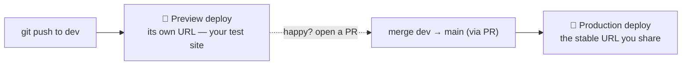

# Deploying with Vercel — branches, dev/prod, and protection

> Plain-English notes from the day we put the homepage live. Concepts: how a push becomes a live site,
> how dev/prod separation works, and the login-wall gotcha.

## The big idea: a git push becomes a website

We connected our GitHub repo to Vercel. From then on, **Vercel watches the repo and rebuilds the site
whenever we push.** No manual upload. That's "continuous deployment."

## One project, many environments (not two projects)

The instinct is "make a dev site and a prod site." Vercel does it differently — **one project with
branch-based environments**:

- **Production** = whatever is on the **production branch** (`main` for us) → the stable URL.
- **Preview** = every *other* branch (like `dev`) → each gets its own URL, isolated from production.
- **Development** = your laptop (`npm run dev`).

Why this is nice: later we can give each environment **different environment variables** — e.g. Preview
points at our **dev** Supabase database, Production points at the **prod** one. Same code, different data,
zero risk of testing against real data.

Our flow: work on `dev` → push (get a preview URL to test) → **open a PR `dev` → `main`** → merge → production updates.

## Root Directory matters in a monorepo

Our repo holds two apps: `web/` (the site) and `api/` (the backend). Vercel only deploys the site, so we
told it **Root Directory = `web`**. Without that, it looks at the repo root, finds no `package.json`, and
the build fails.

## The login-wall gotcha (Deployment Protection)

Our first deploy worked but the URL bounced everyone to a **Vercel login page**. That's **Deployment
Protection → "Require Log In"**, on by default. Great for a private staging app, wrong for a public
marketing page. Fix: Settings → Deployment Protection → turn **"Require Log In" OFF** → Save.

Also: there are two kinds of URL.
- `keyzforme-**<random-hash>**-….vercel.app` = a **specific build's** address. Stays protected. Don't share it.
- `keyzforme-….vercel.app` (no hash) = the **production alias**. Public. **This is the one to share.**

## One-line takeaways
- A push to the production branch = an automatic deploy.
- `dev` = preview/test, `main` = production; promote with a PR.
- Monorepo → set Root Directory to the app's folder.
- Turn off "Require Log In" for a public site; share the hash-less URL.
