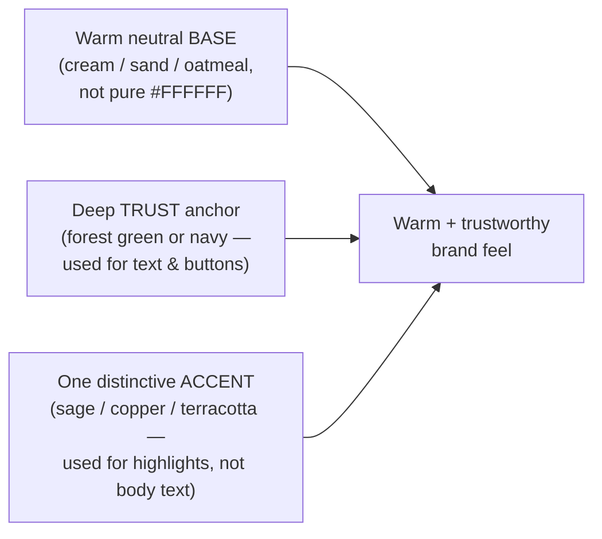

# Color direction for Keyz (2025–2026 research)

> Deep-research findings (fact-checked: 21 claims confirmed, 4 refuted). Used to pick the Keyz brand palette.
> Saved 2026-06-18.

## The big idea

In 2025–2026, the look people trust *and* like is a move **away from generic "SaaS blue"** toward a
**warm neutral base + one grounded, natural accent**. It signals trust (deep green/navy) and warmth
(cream + earthy accent) at the same time.

## Why (color psychology — directional, not magic)

- **Blue** = trust/competence — but overused in fintech, so it reads as "invisible / sea of sameness."
- **Green** = growth, stability, wealth → great trust anchor that *isn't* blue.
- **Brown / earth tones** = grounded, reliable, "organic, approachable, non-judgmental" → fits financial *coaching*.
- **Warm off-whites** = friendly, easy on the eyes; the modern replacement for stark white.
- ⚠️ Color's effect on trust is **real but limited** — it's necessary, not sufficient. Don't over-claim it.

## Recommended palettes (exact hex)

| Name | Base | Surface | Trust anchor / text | Accent | Secondary |
|------|------|---------|--------------------|--------|-----------|
| **A · Navy + Sage** (safest, "approachable first-time buyers") | `#F5F0E8` | `#FFFFFF` | `#1B3A6B` navy | `#7C9A7E` sage | — |
| **B · Copper & Ink** (distinctive, heritage-credible) | `#FBF4EE` | `#E7D4C2` | `#2C2A28` ink | `#B87333` copper | `#6B5A4D` brown |
| **C · Forest + Emerald-Teal** (growth + trust) | warm cream | `#FFFFFF` | `#1F4D3A` forest | `#7C9A7E` sage / `#10B981→#14B8A6` teal | — |
| **D · Brown + Beige** (data/dashboard fit) | `#F5F5F5` | `#D7CCC8` | `#5A4034` brown | `#8D6E63` | `#A1887F` |

## Accessibility (non-negotiable)

- Body text ≥ **4.5:1** contrast; large text/icons/input borders ≥ **3:1** (WCAG AA).
- Deep anchors pass easily: deep green `#14532D` = **9.1:1** on white; navy `#1B3A6B` clears AAA.
- ⚠️ Pale accents fail body-text contrast (sage ≈2.8:1, copper ≈3.4:1 on white) → use them for **fills,
  borders, large headings, decoration** only; use the dark anchors for actual text.

## Real-brand precedent

- **Koa** (savings app) chose warm "guava" orange-pink as primary "to feel human-centred" yet trustworthy.
- **Neo Financial** uses warm brown for groundedness/reliability.
- **Linear / Vercel / Arc** — differentiate via restraint (monochrome + one accent), a model Keyz can copy.

## Don't repeat these (refuted in verification)

- ❌ "54% of consumers trust blue most" (Adobe stat) — not substantiated.
- ❌ "Green confirmation screens trigger dopamine" — not substantiated.
- ❌ "70%+ of SaaS use blue" as a hard number — unverified (directionally true that blue is overused).

## Sources

UpDivision, Wix, Figma, Lummi, Lounge Lizard, Recursion (2026 UI color trends); BFA Global & Luxury
Presence (fintech/real-estate brand color); Phoenix Strategy & media.io (palettes); W3C WCAG 2.1 &
WebAIM (contrast). Primary psych: Labrecque & Milne 2012; Alberts & van der Geest 2011.
